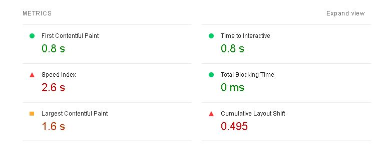
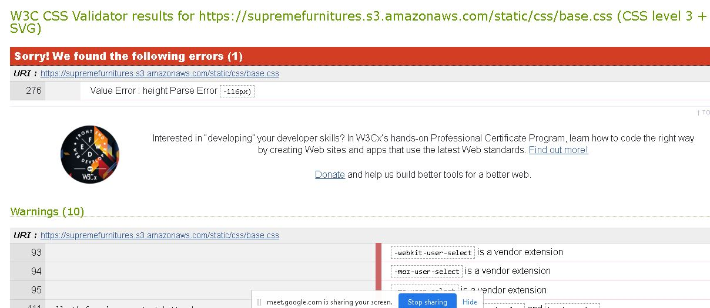

### Testing ###

## Index 

- <a href="#manual-testing">1. Manual Testing</a>
- <a href="#automated-testing">2. Automated Testing</a>
- <a href="#validators">3. Validators</a>

### Manual Testing ###

### Automated Testing ###

### Testing Apps  ###

### Lighthouse Testing  ###

Lighthouse is an open-source, automated tool for improving the quality of web pages. You can run it against any web page, public or requiring authentication. It has audits for performance, accessibility, progressive web apps, SEO and more.

* Image formats like WebP and AVIF often provide better compression than PNG or JPEG, which means faster downloads and less data consumption.
* Serve images that are appropriately-sized to save cellular data and improve load time.
* Resources are blocking the first paint of your page. Consider delivering critical JS/CSS inline and deferring all non-critical JS/styles.

### Validators ###

* <a href="https://validator.w3.org/">HTML Validators</a>

    Errors: No major errors found.
    There were some minor errors found. 
    1. Bad value attribute src on element image - There is a space in the image url which can be fixed in the server path and implement it in the code.
    
    
    2. Attribute "value" not allowed on element <a> - This can be fixed by removing the value attribute for the element <a>
    

    3. Duplicate ID user-options - We can change one of the instances of id = user-options to a different value which will fix the error.
    

* <a href="https://jigsaw.w3.org/css-validator/">CSS Validators</a>
    Results:
        1. base.css: Height parse error.
        

        2. contact.css: No errors found.
        3. feedback.css: No errors found.
        4. review.css: No errors found.

* <a href="https://jshint.com/">JSHint</a>
    Results:
     1. One undefined variable $

* <a href="http://pep8online.com/">Python Validator | PEP8</a>
    Results: No major errors found! Only lint errors.

