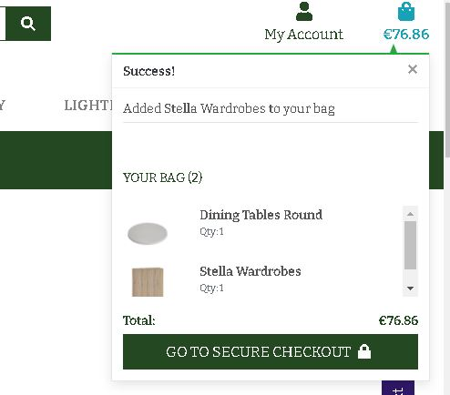
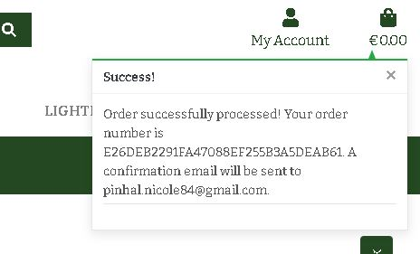

### Testing ###

## Index 

- <a href="#manual-testing">1. Manual Testing</a>
- <a href="#automated-testing">2. Automated Testing</a>
- <a href="#validators">3. Validators</a>

### Manual Testing ###
### ClIENT STORIES TESTING

#### As a casual/new visitor to the website, I want to:
1. Visit **Supreme Furnitures website** so that I can view what they have in stock.

*Testing* 
- when the user clicks the link https://supremefurnitures.herokuapp.com/ is taken to the actual site and they can view what is on stock.

*Result* : Passed

2. Access the website from any device, so that I can view the website on desktop, mobile, or tablet.

 *Testing*:
- The visitor can visite the website on any device. The website is designed for computer, mobile and tablet. 

*Result* : Passed

3. Navigate the site **without having to register an account** so that I can browse through the site.

*Testing*
- Any user can navigate the site and browse products even if not registered.

*Result*: Passed

4. Navigate easily through the website so that I can find everything easily.
- *Testing* 
- A visitor can navigate through the website with the navbar on top of the website. There is a hamburger menu for mobile visitors, where they can easily go to every relevant page.

*Result* : Passed

5. See **different categories** on the navigation menu so that I can have an idea of what type of products are sold.
- *Testing* 

All the different categories can be found on the main navigation bar. When the user hovers each category,  a sub-menu pops up showing sub-categories to give the user a clear idea of all the products sold.

The user can see some of the the main category information displayed on cards as they scroll down the site. While the user is still on the same section, they can find information about delivery, quality status, and checkout so that they can be aware as they browse through.

*Result* : Passed

7. Search for a product by **name or category** to quickly see if it is available.

 *Testing* 

On the top header is a search functionality, where visitors can search for products. The search functionality is based on the category or product name.

*Result* : Passed

8. See the **total of my bag** at any time to avoid spending much and keep updated.

*Testing* 

The total of the user's bag is always visible on the navigation bar, underneath the bag icon. On mobile view, this is also visible below the search functionality.

When a user adds an item to their bag, it is added to the bag and a notification appears letting the user know it is in their bag.

*Result* : Passed

9. **Easily sort and filter** the available products across all/specific categories, identifying the best rated, best priced, and alphabetically sorted.

*Testing* 

On the products page to the top right there is the option for users to sort the products based on price, rating, category or name.

When user click the arrow a drop down is displayed, the user can select any option based on what they sort option they are looking for.

*Result* : Passed

10. Easily access a specific category of available products, so that I can quickly find what I am looking for.

*Testing* 
Users can easily access specific categories through the navigation bar. All categories are listed there, including a sub menu for a quicker access.

*Result* : Passed

11. See **slide show images** so that I can stay longer and explore the site.

*Testing* 
User can see the slide show images and hopefully stay longer on the site.

*Result* : Passed

12. See **shop living, shop dining, shop bedroom, and shop accessories** displayed in cards, so that I can easily navigate to a certain category.

*Testing* 

Users can see **shop living, shop dining, shop bedroom, and shop accessories** displayed in cards as they sroll down the site. There is a text link on each card. The user can easily
navigate to a certain category by clicking on the link they would like to navigate to. They can also navigate by clicking on the green button, however the button for shop living is not working at the moment therefore the user can use the text link instead.
 

*Result* : Some passed. The button for shop living is not working at the moment therefore the user can use the text link instead.

13. **View items in my bag, adjust or delete** the number of items so that they can fit my budget.

*Testing* 

Users can easily adjust and delete items from their bags. When the quantity toggle +/- button is clicked on, the quantity changes, and when the user clicks on the 'update' button, the quantity is updated.
Users can also remove items from their basket when the 'remove' button is clicked.
 

*Result* : Passed

14. Know more about the company, find the **review us, register now and discount code buttons** so that I can register if I am interested.

*Testing* 
On the home page, when the user scroll down the site can find information about the company, the **review us, register now and discount code buttons**.

*Result* : Passed

15. View more information on a particular piece of furniture so that I can know more about the product.

*Testing* 
Visitors can visit the product detail page by clicking on the image of the product.
The product detail page will shows the following information: product name, price,category and rating.
Visitors can buy the product and set the quantity of the product. 

*Result* : Passed

16. Revisit my shopping bag so that I can **continue shopping or proceed to checkout.**

*Testing* 
User can revisit their shopping bag by clicking on the go to secure checkout or the bag icon at the top. 

When user is on the shopping bag page, can decide if to checkout or to continue shopping.

*Result* : Passed

17. Make a **simple secure payment** on the site and hassle-free, so that I can feel confident that my card details are safe.

*Testing* 
Users can pay with credit card and the payment goes via Stripe payments securely.
A Stripe webhook is implemented for extra secure payments.
The consumer has to fill in personal information and delivery information.

*Result* : Passed

18. Receive a **confirmation email** with information about my order so that I can view my order details again.

*Testing* 
When the purchase is succeeded the user is redirected to the checkout success page. On the page is a order summary and it will mention that the consumer will receive an email confirmation.
A email confirmation is sent to the consumer. The email is connected with gmail and when a purchase is made, a automatic confirmation is send from supremefurnitures22@gmail.com to the consumer.

*Result* : Passed ( Note: Not able to show the actual email. I just realised google blocked the account or there are some problems I can not fix now.)
Another screen shot will verify this as I have some password which were reset hence an email was sent out to the customer.

19. Contact the site owner/administrator via a form, so that I can inquire about any questions or issues I may have.
*Testing* 
A link to the contact page is found in the footer of the website or on the side of the each page, there is a blue contact button. When the button is clicked a contact page pops up.

*Result* : Passed

20. **Create an account**, so I can see my profile details and order history.

*Testing* 
User can create an account by signing up.
The consumer can see the personal information, delivery information and the order history.
The consumer can change the delivery information by updating the details and the consumer can change the password or manage email.

*Result* : Some passed and a few failed.

 As reflected on the screen shot, it will be very difficult for the user to view all their history information properly. The navigation bar is stucking on some of the pages like the profile page.

21. Leave a review so that I can give my feedback.

*Testing* 
User can leave a feedback only if is registered. They can also view their feedback if they decide to do so.
Note that the delete and edit buttons are not working.

*Result* : Some passed, some failed.

22. Read reviews from previous customers so that I can know what to expect.
**Note: I struggled to the functionality working**
*Result* : failed.

23. Social media links so that I can follow the site owner and get a feel for the credibility of the site.

*Testing* 
User can clearly fing social media links and can follow the site owner to get updates on furniture.

*Result* : Passed

#### As a registered user, I want to:

1. **Login and logout at my account** anytime, so I can make an order quickly and so I can see my order history.
*Testing* 
User can login and logout through profile icon in the navbar.
User has a double check for logging out.

*Result* : Some passed some failed.
The user is able to log out but user experience is lacking as reflected by the navbar hiding the head tag.

2. Reset/change my password (if I forgot it), so I can get access to my profile.

*Testing* 
The password can be changed by clicking the button on the profile page or by the login page.

*Result* : Passed.

3. Log out easily, so that I can **keep my account private** if I am not using my personal device, for example using a work device.

*Testing* 
User can log out and keep their account private, if not using personal device. The user has to make sure they are logged out okay since the navbar has some css problems which are not fixed.

*Result* : Failed.

4. **Create, update or delete** my personal information so that I can have up-to-date information.
*Testing* 
User can create or update their personal information.for example, change of address or phone number.
*Result* : Passed.

#### Site owner, I want to be able to: 
1. Add new items to the store easily.
*Testing* 
The admin can add new items, create a name, rating, price title, category by uploading an image from their local device.
*Result* : Passed.

2. Edit and update existing products to change pricing, description images, and other criteria.
*Testing* 
The admin can edit items through the 'edit a product' page that allows the admin to edit a product in any aspect. The category, SKU, name, price, rating, and image can all be edited and changed.

### Automated Testing ###

#### Lighthouse Testing  ####

Lighthouse is an open-source, automated tool for improving the quality of web pages. You can run it against any web page, public or requiring authentication. It has audits for performance, accessibility, progressive web apps, SEO and more.

 
* Image formats like WebP and AVIF often provide better compression than PNG or JPEG, which means faster downloads and less data consumption.
* Serve images that are appropriately-sized to save cellular data and improve load time.
* Resources are blocking the first paint of your page. Consider delivering critical JS/CSS inline and deferring all non-critical JS/styles.

### Validators ###
* I used different browsers to check how the site respond when opened on each.

* The site loads and responds as expected on Google Chrome, Opera, Microsoft Edge, and on Firefox browsers some problems should be expected. For example, as you naviage the site, on each and every page is a green feedback button and the blue contact button sitting on the left side of each page. The text on the buttons is faced down which is awkward to read the text. 

* <a href="https://validator.w3.org/">HTML Validators</a>

    Errors: No major errors found.
    There were some minor errors found. 
    1. Bad value attribute src on element image - There is a space in the image url which can be fixed in the server path and implement it in the code.
    
     
    2. Attribute "value" not allowed on element <a> - This can be fixed by removing the value attribute for the element <a>
    
     
    3. Duplicate ID user-options - We can change one of the instances of id = user-options to a different value which will fix the error.
    

* <a href="https://jigsaw.w3.org/css-validator/">CSS Validators</a> 
    Results:
        1. base.css: Height parse error.
        
         
        2. contact.css: No errors found.
        3. feedback.css: No errors found.
        4. review.css: No errors found.

* <a href="https://jshint.com/">JSHint</a> 
    Results:
     1. One undefined variable $

* <a href="http://pep8online.com/">Python Validator | PEP8</a> 
    Results: No major errors found! Only lint errors.

